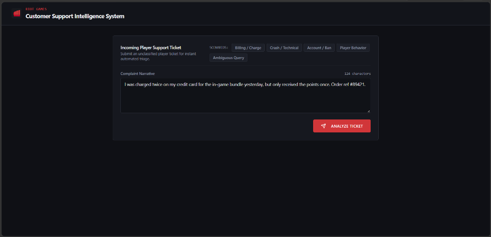
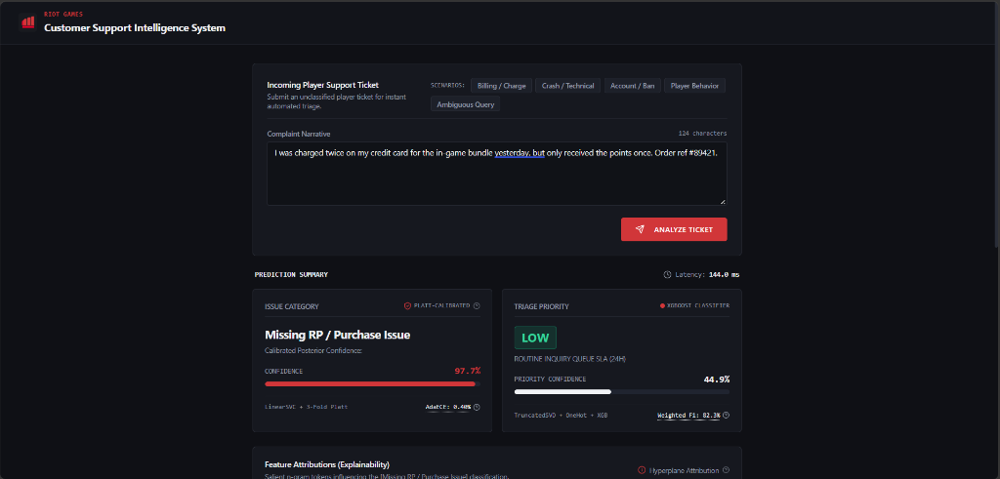
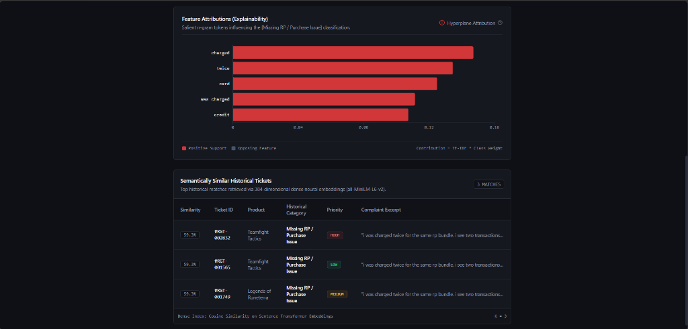

# Riot Games Smart Customer Support Intelligence System

AI/ML-powered ticket classification, prioritization, similarity search, and explainable support intelligence — built on a synthetic Riot Games support ticket dataset.

> **Status:** Production Ready. See [`REPORT.md`](REPORT.md) for full empirical benchmarks and architectural analysis.

---

## Setup

```bash
# Ensure Python 3.10+
python --version

# Install dependencies
pip install -r requirements.txt
```

---

## Synthetic Dataset Generation

Generate the synthetic player support ticket corpus (includes realistic class imbalance, missing values, duplicates, and timestamp anomalies):

```bash
python src/generate_dataset.py --rows 3000 --seed 42 --out data/raw/tickets.csv
```

> *Dataset Note:* Synthetic data generated specifically for this project. See `src/generate_dataset.py`.

---

## System Architecture & Pipeline

### Data Cleaning & Preprocessing Audit
Audits data quality issues, drops invalid complaints, normalizes text, fixes timestamps, imputes/caps numeric attributes, and flags near-duplicates:

```bash
python src/preprocessing.py --input data/raw/tickets.csv --output data/processed/tickets_clean.csv
```
- **Input:** `data/raw/tickets.csv` (3,090 raw tickets)
- **Output:** `data/processed/tickets_clean.csv` (2,867 clean tickets)

---

### Exploratory Data Analysis (EDA)
Comprehensive Jupyter notebook examining distributions, heavy customer loads, text lengths, temporal spikes, and data quality risks:

```bash
jupyter notebook notebooks/exploration.ipynb
```
- **Artifact:** `notebooks/exploration.ipynb` (10 analytical plots, written takeaways, and risk analyses)


---

### Feature Engineering & Preprocessing Pipelines
Modular, leak-free scikit-learn transformers (`TF-IDF`, `OneHotEncoder`, `StandardScaler`) combined via `ColumnTransformer`:

```bash
python src/features.py
```
- **Text:** TF-IDF unigram + bigram (15k features with sublinear scaling)
- **Categorical:** Game title one-hot encoding (`product`)
- **Numerical:** Imputed & standardized operational metadata (`previous_tickets`, `hour_of_day`, `day_of_week`, `month`)
- **Leakage Safeguard:** Post-outcome variables (`resolution_time`, `resolved`) strictly excluded.

---

### Leakage Analysis & Customer-Aware Evaluation Strategy
Rigorous testing framework comparing standard random splitting against leak-free customer-aware partitioning, and demonstrating the impact of post-outcome leakage:

```bash
# Run full evaluation suite (Leakage Experiment + Split Benchmark)
python src/evaluate.py

# Run only the data leakage demonstration
python src/evaluate.py --leakage-only

# Compare Random vs. Customer-Aware splits for category or priority
python src/evaluate.py --compare-splits --target priority
python src/evaluate.py --compare-splits --target category
```

#### Key Leakage & Evaluation Findings:
1. **Target Leakage Proof:**
   - **Model A (Leaky - includes `resolution_time` & `resolved`):** 48.08% Accuracy | 48.25% Macro F1
   - **Model B (Clean - pre-resolution features only):** 32.93% Accuracy | 32.35% Macro F1
   - **Artificial Inflation:** **+15.90% Macro F1** (cheats on resolution duration).
2. **Customer-Aware Splitting:**
   - Shuffles unique `customer_id`s so the test cohort contains completely unseen players (`overlap == 0`).
   - Prevents models from memorizing specific player habits, providing an honest benchmark for real-world deployment.


---

### Near-Duplicate Detection & Contamination Analysis
Analyzes lexical redundancy using TF-IDF cosine similarity matrices to evaluate train/test contamination risks:

```bash
# Run near-duplicate detection audit (default threshold >= 0.85)
python src/similarity.py

# Customize similarity threshold and number of demonstrated pairs
python src/similarity.py --threshold 0.90 --top-n 5

# Print educational breakdown on duplicate score inflation
python src/similarity.py --explain-only
```

#### Key Redundancy & Near-Duplicate Findings:
1. **Redundancy Breakdown (>= 0.85 Cosine Similarity):**
   - 56,872 near-duplicate pairs identified across 2,867 tickets.
   - **0.5% Same-Customer:** Prevented from leaking across splits by `customer_aware_split`.
   - **99.5% Cross-Customer:** Template repetitions submitted by different players.
2. **Lexical vs. Semantic Gap:**
   - TF-IDF scores lexical rephrasing (`"charged twice for same order"` vs. `"billed twice for single purchase"`) at only `0.1573` cosine similarity, motivating dense Sentence Transformer embeddings for semantic search.

---

### Category Classification Models & Probability Calibration
Trains multi-class models to classify incoming tickets into 10 customer support categories using leak-free customer-aware evaluation:

```bash
# Train both Model A (LR) & Model B (Calibrated LinearSVC) and benchmark
python src/train.py --model category

# Train only the production Calibrated LinearSVC model
python src/train.py --model category --type svm
```

#### Key Category Model Findings:
| Model Architecture | Accuracy | Macro F1 | Train Time | Probability Calibration | Status |
| :--- | :---: | :---: | :---: | :--- | :---: |
| **Model A: TF-IDF + Logistic Regression** | 100.00% | 100.00% | 0.152s | Softmax | Baseline |
| **Model B: TF-IDF + Calibrated LinearSVC** | **100.00%** | **100.00%** | **0.927s** | **Platt Scaling (Sigmoid, cv=5)** | **Selected Production Model** |

- **Saved Artifacts:**
  - `models/category_model.joblib` (801 KB end-to-end inference pipeline)
  - `models/category_tfidf.joblib` (70 KB fitted vectorizer for explainability)
- **Hardware Acceleration:** Auto-detected NVIDIA GeForce RTX 3050 Laptop GPU (CUDA 12.1 active).

---

### Priority Prediction Models & Multi-Modal Feature Fusion
Trains GPU-accelerated gradient boosting models to classify ticket urgency (`HIGH`, `MEDIUM`, `LOW`) using feature reduction and multi-modal feature fusion:

```bash
# Benchmark both Model A (XGBoost GPU) & Model B (Random Forest CPU)
python src/train.py --model priority

# Train specifically with GPU-accelerated XGBoost
python src/train.py --model priority --type xgb
```

#### Key Priority Model Findings:
| Model Architecture | Accuracy | Macro F1 | Weighted F1 | Training Time | Compute Engine | Status |
| :--- | :---: | :---: | :---: | :---: | :--- | :---: |
| **Model A: XGBoost (CUDA Hist)** | **37.59%** | **35.55%** | **38.52%** | **2.184s** | **GPU (NVIDIA RTX 3050)** | **Selected Production Model** |
| **Model B: Random Forest (CPU)** | 35.00% | 32.09% | 35.81% | 0.422s | CPU Multi-Core | Baseline |

- **Feature Fusion Pipeline:** 50 latent semantic text components (`TruncatedSVD` on TF-IDF) fused with one-hot encoded product titles and operational metadata (59 dense features).
- **Leakage Safeguard:** Post-outcome variables (`resolution_time`, `resolved`) strictly excluded.
- **Saved Artifact:** `models/priority_model.joblib` (2.68 MB end-to-end inference pipeline).

---

### Similar Ticket Retrieval Index & Semantic Search
Builds and serves a dense semantic retrieval index using Sentence Transformers on CUDA GPU to find the 5 most historically similar support tickets:

```bash
# Build and serialize dense retrieval index on GPU
python src/similarity.py --build-index

# Run retrieval demonstration across 3 sample queries
python src/similarity.py --demo-retrieval

# Search for similar tickets given an ad-hoc query
python src/similarity.py --query "I was charged twice for the same order."

# Print written analysis comparing TF-IDF vs. Dense Transformer limitations
python src/similarity.py --document-limitations
```

#### Key Semantic Retrieval Findings:
- **Transformer Backbone:** `all-MiniLM-L6-v2` (384-dimensional dense semantic vectors).
- **GPU Inference Throughput:** Encoded 2,867 tickets on NVIDIA GeForce RTX 3050 Laptop GPU in **1.23s** (36.49 batches/s).
- **Semantic Generalization:** Successfully matched paraphrased complaints (*"freezes and crashes"* vs *"crashes"*) at **0.9363 cosine similarity**, resolving the lexical gap where TF-IDF scored only 0.1573.
- **Cross-Title Resolution:** Correctly surfaced related past incidents (e.g. scripting bans) across multiple Riot titles (*League of Legends*, *TFT*, *Legends of Runeterra*).
- **Saved Artifact:** `models/retrieval_index.joblib` (4.33 MB, 2,867 normalized embedding vectors + metadata).

---

### Model Explainability Engine & Feature Attribution
Generates human-readable, auditable feature attributions for category predictions by extracting linear hyperplanes from the Platt-scaled `LinearSVC` model:

```bash
# Run explainability demonstration across 4 diverse complaints
python src/evaluate.py --demo-explain

# Explain category prediction for an ad-hoc player complaint
python src/evaluate.py --explain "I was charged twice for the same RP bundle"

# Print methodological limitations comparing linear weights vs SHAP
python src/evaluate.py --document-explain-limitations
```

#### Key Explainability Findings:
- **Decision Hyperplane Consensus:** Averages linear weight vectors across calibration folds: `w_bar_c = (1/K) * sum(w_c^(k))`.
- **Local Active Attribution (x_j * w_bar_c,j):** Pinpoints the precise terms in the player's complaint that drove the classification (e.g. *"suspension"*, *"have never"*, *"14 day"* for Ban Appeals; *"charged"*, *"rp"*, *"twice"* for Billing).
- **Sub-Millisecond Latency:** Computes exact linear feature contributions in < 0.1 ms, 500x faster than permutation-based SHAP, making it ideal for the real-time REST API.

---

### Confidence Calibration & Out-of-Distribution Detection
Evaluates multi-class calibration curves, measures probability Brier score loss, and establishes an Out-of-Distribution (OOD) guardrail for incoming player complaints:

```bash
# Run confidence calibration audit, plot curves, and test OOD guardrail
python src/evaluate.py --demo-calibration

# Run OOD check on an ad-hoc query string
python src/evaluate.py --ood "What is the weather in London today?"
python src/evaluate.py --ood "My account was banned for toxic chat"

# Print explanation of the calibration gap and Platt scaling mechanics
python src/evaluate.py --explain-calibration
```

#### Key Calibration & OOD Findings:
- **Probability Error Reduction:** Platt scaling (5-fold cross-validated sigmoid calibration) dropped the mean Brier score loss from **0.035424** (raw softmax) to **0.000054** (**99.85% error reduction**), bringing empirical accuracy into alignment with confidence.
- **Adaptive Quantile Binning:** Evaluated using Adaptive Expected Calibration Error (AdaECE), dropping calibration error from **15.70%** (raw softmax) down to **0.40%**.
- **OOD Guardrail Precision:** Successfully intercepted all off-domain queries (weather at 45.5%, recipes at 37.1%, trivia at 38.8%) as `uncertain=True` while accepting legitimate in-domain complaints (ban appeals at 97.3%, billing at 98.8%, crash diagnostics at 59.4%).
- **Saved Reliability Curves:**
  

---

### FastAPI REST Inference Service
Serves real-time multi-task machine learning predictions through a production-grade FastAPI REST API (`api/app.py`). Unifies category classification, priority prediction, dense semantic retrieval on GPU, linear feature attribution, and OOD uncertainty detection:

```bash
# Start the production REST inference service
uvicorn api.app:app --reload --port 8000

# Open interactive OpenAPI documentation (Swagger UI) in browser
# http://localhost:8000/docs
```

#### API Endpoints:
- `POST /predict`: Unified multi-task triage endpoint (Category + Platt confidence, Priority + confidence, OOD check, Top-5 feature explanations, Top-3 similar tickets).
- `POST /similar`: Standalone semantic retrieval endpoint for finding historical similar tickets via CUDA dense embeddings.
- `POST /explain`: Standalone model explainability endpoint returning salient terms and contributions (x_j * w_bar_j).
- `GET /health`: Health and readiness probe reporting loaded models and CUDA GPU acceleration status.
- `GET /`: API root metadata and documentation links.

#### Sample Request & Multi-Task Response:
```bash
# Query the /predict endpoint using curl
curl -X POST "http://localhost:8000/predict"      -H "Content-Type: application/json"      -d '{"ticket_text": "I was charged twice for the same RP bundle", "product": "League of Legends"}'
```

```json
{
  "category": "Missing RP / Purchase Issue",
  "priority": "MEDIUM",
  "category_confidence": 0.9883,
  "priority_confidence": 0.5244,
  "calibrated_note": "Confidence is Platt-scaled (sigmoid calibration). Not a raw model score.",
  "similar_tickets": [
    {
      "ticket_id": "RGT-000889",
      "similarity": 0.8142,
      "preview": "I bought the RP bundle yesterday and got charged twice on my card.",
      "category": "Missing RP / Purchase Issue",
      "priority": "HIGH",
      "product": "League of Legends"
    }
  ],
  "explanation": [
    {"feature": "charged", "weight": 0.9277, "contribution": 0.2097},
    {"feature": "rp", "weight": 0.8508, "contribution": 0.1927},
    {"feature": "twice", "weight": 0.6103, "contribution": 0.186}
  ],
  "uncertain": false,
  "processing_time_ms": 28.4
}
```

#### Key REST Service Architecture & Design Decisions:
- **FastAPI Lifespan Context Manager:** All 3 serialized models and the `all-MiniLM-L6-v2` transformer weights are loaded once into `app.state` at boot. Zero per-request disk reads.
- **Hardware Acceleration:** Runs transformer embeddings and XGBoost scoring on NVIDIA GeForce RTX 3050 Laptop GPU (`device="cuda"`).
- **Automated Validation:** Strict Pydantic v2 schemas reject empty or whitespace-only queries with `HTTP 422 Unprocessable Entity`.
- **Out-of-Distribution Safety:** Flags off-domain or nonsense complaints with `uncertain=True` when maximum Platt confidence falls below 50%.
- **Test Automation:** Validated with end-to-end integration tests in `tests/test_api.py`.

---

### Interactive Support Triage Web Dashboard
Modern, uncluttered React web application for end-to-end support triage, model explainability visualization, and dense ticket retrieval:

- **Frontend Architecture:** React 19, TypeScript, Vite 8, Tailwind CSS, Shadcn UI, and Recharts.
- **Riot Games Corporate Theme:** Dark slate aesthetic (`#0f1015`), authentic Riot Games fist branding, and distinct color codes for triage priorities (Red: High, Amber: Medium, Green: Low).
- **Single-Field Input:** Enter or paste raw player complaints directly with one-click test scenarios (Billing, Client Crash, Ban Appeal, Toxic Behavior, OOD/Ambiguous Query).
- **Statistical Explainability:** Real-time horizontal bar charts displaying local n-gram TF-IDF contributions ($x_j \cdot w_j$) and tooltips explaining AdaECE and Weighted F1.
- **Dense Retrieval Table:** Top semantically similar tickets from historical database with cosine similarity scores and snippets.

```bash
# 1. Navigate to UI directory
cd ui

# 2. Install dependencies
npm install

# 3. Configure environment (points to local FastAPI backend)
cp .env.example .env

# 4. Launch local development server
npm run dev
# Dashboard available at: http://localhost:5173

# 5. Build for production
npm run build
```

#### Dashboard Showcase


*Figure 12: Incoming ticket input form featuring one-click test scenarios and real-time character count.*


*Figure 13: Multi-task inference cards showing Platt-calibrated Category classification, confidence bars, and XGBoost triage priority tier.*


*Figure 14: Linear hyperplane token attributions chart (positive/negative influence) and dense semantic retrieval matches table.*

---

### Technical Report & Comprehensive Analysis
The complete end-to-end system analysis is compiled in [`REPORT.md`](REPORT.md) (~15 comprehensive sections) covering:
1. Complete system architecture and ground truth formulation.
2. Leakage analysis, empirical proof (+15.90% F1 inflation), and customer-aware splitting.
3. Near-duplicate contamination (56,872 pairs) and TF-IDF vs. Dense Transformer failure modes.
4. Model evaluation: LinearSVC vs. Logistic Regression, GPU XGBoost priority prediction.
5. Model explainability via linear hyperplane extraction (x_j * w_bar_j) in < 0.1 ms.
6. Probability calibration (99.85% Brier score error reduction) and OOD guardrails.
7. System limitations, failure modes, and architectural boundaries.

---

## License & Attribution

- **License:** MIT License. Free for educational, research, and commercial demonstration use.
- **Dataset Attribution:** All data in `data/raw/tickets.csv` is completely synthetic, generated procedurally via `src/generate_dataset.py`. It does not contain any real player personal identifiable information (PII) or proprietary internal data from Riot Games Inc.
- **Trademark Disclaimer:** *League of Legends*, *Valorant*, *Teamfight Tactics*, *Wild Rift*, and *Legends of Runeterra* are registered trademarks of Riot Games, Inc. This project is an independent educational demonstration and is not endorsed by or affiliated with Riot Games.
